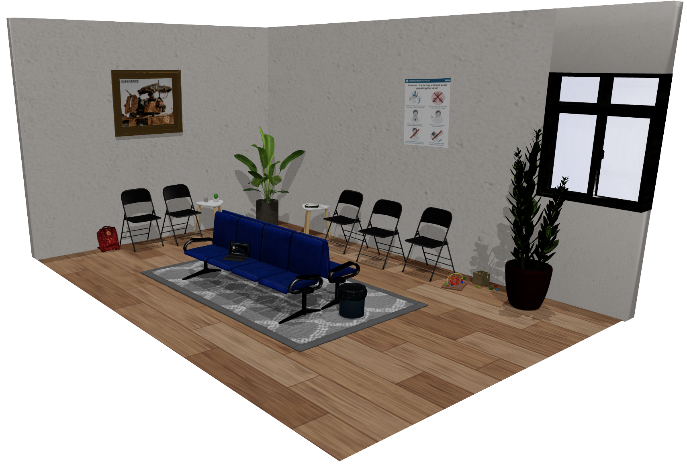

# portfolio-project

## https://www.gabrielcolt.com/

**TECH STACK** 🧑‍💻🧑‍💻🧑‍💻

*Database - PostgreSQL 🤠 \ Deployment - Docker & RENDER 😈\ Backend - Node.js 💀\ Frontend - React, Three.js 🐗*

**BRANCHES**🌳🌳🌳

**main** - Production branch, automatic (NOW STATIC) deploy to render on commit

**deployment_AWS_notActive** - 1st production branch, set up for deployment on AWS using AWS Fargate

**deployment_Render_Backend_notActive** - 2nd production branch, deployment on Render using a PSQL backend

**dev_gabriel_staticPage** - Development branch, used for development on the last, static site for 💰💰💰 reasons

**TO - DO** ✏️✏️✏️
1. DOCKER & PostgreSQL ✅✅✅
3. Backend-API in Node.js/Express ✅✅✅
4. Build React frontend ✅✅✅
5. Deployment in AWS ✅✅✅ (EXPENSIVE - MOVED TO RENDER AFTER COMPLETING IT

**MIGHT - DO** 🤔🤔🤔
1. Admin Panel (CMS) with authentication (Would have to reactivate the backend, probably won't)
2. Automating tests for CI/CD
